# AviUtl2 Layer Grid View

指定したレイヤーのオブジェクトをグリッド状に表示する AviUtl2 用のスクリプトです。


以下のスクリプトが追加されます。

- [レイヤーグリッド表示](#レイヤーグリッド表示)（オブジェクト）
- [セル設定(個別)@レイヤーグリッド表示](#セル設定個別)（フィルタ効果）
- [グリッドオフセット設定(個別)@レイヤーグリッド表示](#グリッドオフセット設定個別)（フィルタ効果）

## 動作環境

[AviUtl ExEdit2](https://spring-fragrance.mints.ne.jp/aviutl/)

- `beta50` 以降必須。`2.1.3a` で動作確認済み。

## インストール

### 手動インストール

[Releases](https://github.com/azurite581/AviUtl2-LayerGridView/releases/latest) から `LayerGridView_v{version}.au2pkg.zip` をダウンロードし、AviUtl2 のプレビューにドラッグ&ドロップしてください。

> [!Note]
> ### For non-Japanese speaking users
> Please download the translation files from [here](https://github.com/azurite581/aviutl2_translations_azurite/releases/latest).

## 使い方

1. あらかじめグリッド状に表示させたいオブジェクトを異なるレイヤーに配置しておきます。  
  後にグリッド状に表示しなおすため、この段階ではオブジェクトは重なっている状態で構いません。
  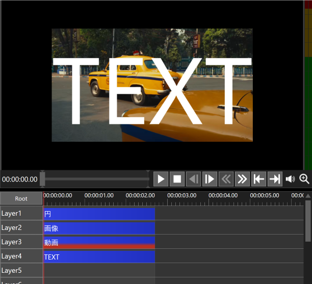

2. カスタムオブジェクトからレイヤーグリッド表示を選択し配置します。このとき、1. でオブジェクトを配置したレイヤーよりも下のレイヤーに配置することを推奨します。
  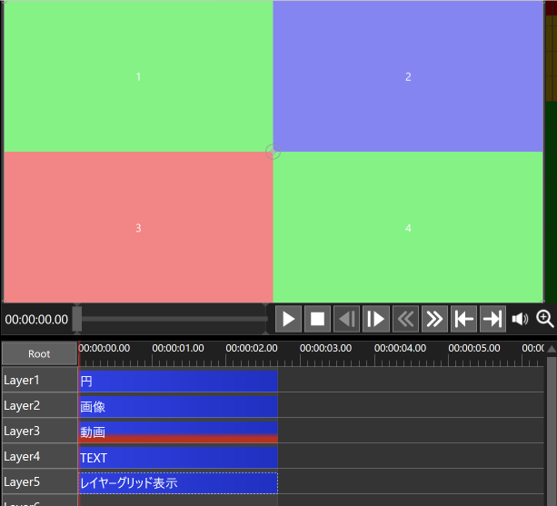

3. `レイヤー設定` の `レイヤー` に、`[セル番号]=レイヤー番号` の形式で、どのセルにどのレイヤーのオブジェクトを表示させるか指定します。  
  以下ではセル 1 に レイヤー 4、セル 2 にレイヤー 2 、セル 3 にレイヤー 3 、 セル 4 にレイヤー 1 のオブジェクトを表示させるため、`[1]=4,[2]=2,[3]=3,[4]=1` と指定しました。
  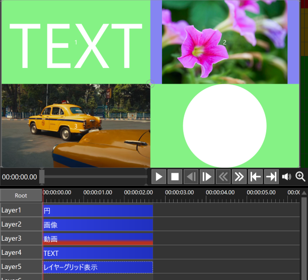

4. セルを個別に編集したい場合は、フィルタ効果を追加 → 配置 → [セル設定(個別)](#セル設定個別) を追加してください。

## レイヤーグリッド表示

指定したレイヤーのオブジェクトをグリッド状に表示するカスタムオブジェクトオブジェクトです。  

### グリッド設定

#### 幅・高さ

グリッド全体のサイズをピクセル単位で指定します。初期値は 1280 x 720 です。

#### スクリーンサイズに合わせる

有効にするとグリッド全体のサイズをスクリーンサイズに合わせます。

#### X個数・Y個数

水平・垂直方向のセル数を指定します。初期値は 3 x 3 で、最大値は 20 x 20 です。

#### 結合リスト

指定したセルを結合して 1 つのセルとして表示します。  
指定するセルは対角線上の 2 点の番号で指定します。結合後のセル番号は、番号が小さいセルになります。

- 例：セル 3 と 5 、12 と 7 を結合する場合
  ```lua
  {3,5}, {12,7}
  ```
  → 結合後のセルの番号は 3 と 7 になります。

#### 結合

有効にすると指定したセルが結合した状態で表示されます。

| 状態 | サンプル | 備考 |
| :---: | :---: | :---: |
| 結合無効 | 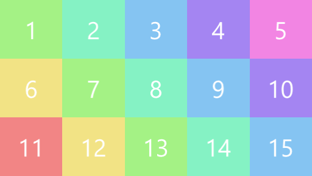 | 初期値 |
| 結合有効 | 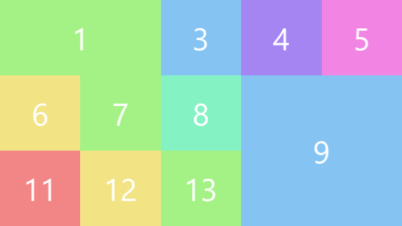 | 結合リスト=`{1,2},{9,15}` |

### グリッドオフセットの設定

#### 列オフセット

`[列番号1]=オフセット値1, [列番号2]=オフセット値2, ...` の形式で、オフセットを調整する列とその量を指定します。
`[列番号]` は、グリッドの左右両端を除く内側の列を対象とし、1始まりで指定します。  
オフセット値は -100 ～ 100 の範囲で指定します。範囲を超えた値は自動的にクランプされます。  
負の値は左方向、正の値は右方向へのオフセットを表します。絶対値が 100 の場合、隣接する列とちょうど同じ位置になります。

| 状態 | サンプル | 備考 |
| :---: | :---: | :---: |
| オフセット無 |  | |
| オフセット有 | 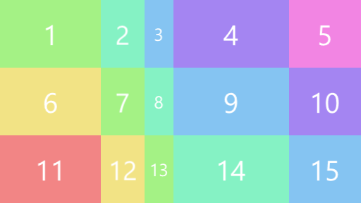 | 列オフセット=`[1]=40,[3]=-60` |

#### 行オフセット

列オフセットと同じ形式で指定します。

| 状態 | サンプル | 備考 |
| :---: | :---: | :---: |
| オフセット無 |  | |
| オフセット有 | 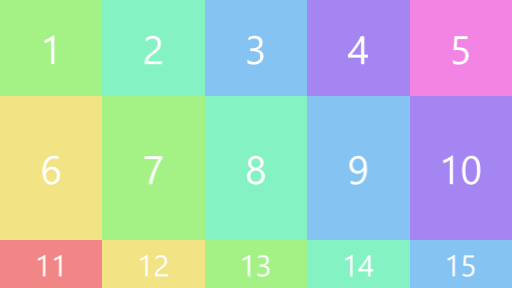 | 行オフセット`[2]=50` |

オフセットにアニメーションを付ける場合は、[グリッドオフセット設定(個別)](#グリッドオフセット個別設定) を適用してください。

### 余白設定

#### `余白X(%)`・`余白Y(%)`

各セル間の余白の幅ををパーセンテージで指定します。

#### `外側余白`

一番外側の余白のタイプを指定します。

| タイプ | サンプル | 備考 |
| :---: | :---: | :---: |
| `通常` | 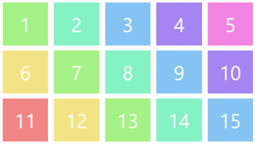 | セル間の余白の半分 |
| `内側の幅と合わせる` | 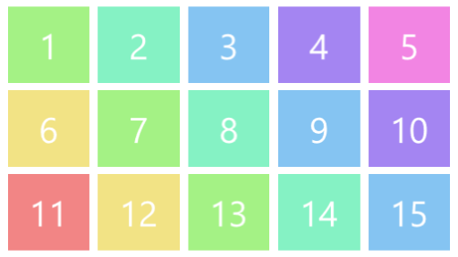 | セル間の余白と同じ幅 |
| `なし` | 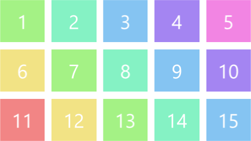 | 外側の余白の幅を 0 にする |

### セル設定

#### セル色を上書き

セルの色はデフォルトではセル数に応じて自動的に彩色しますが、このチェックボックスを有効にすると任意の色で上書きできます。

| 状態 | サンプル | 備考 |
| :---: | :---: | :---: |
| 上書き無効 |  | 初期値<br>（自動彩色） |
| 上書き有効 | 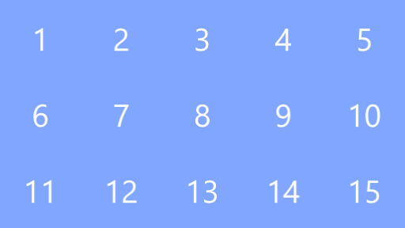 | セルの色=`81a6ff` |

#### セル色

セルの色を指定します。

#### セル透明度

セルの透明度を指定します。

#### 角丸の単位

角丸の単位を指定します。

1. `px`
    - ピクセル単位（初期値）

2. `%`

#### 角丸

丸めるサイズを指定します。

**例**：角丸の単位=`%`、角丸=`40`

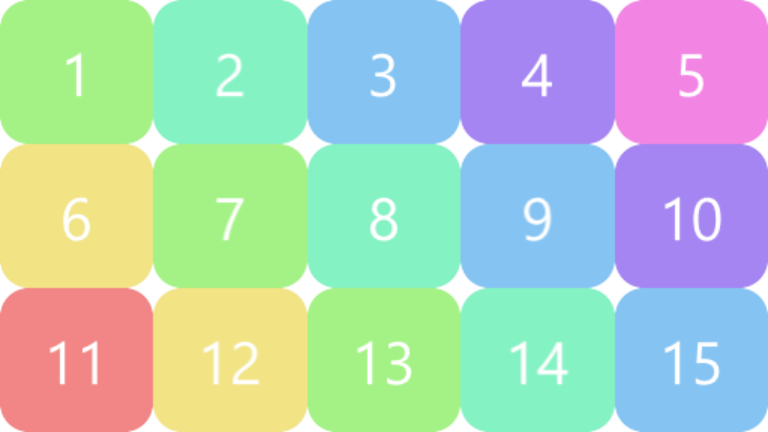

#### 枠幅の単位

枠幅の単位を指定します。

1. `px`
    - ピクセル単位（初期値）

2. `%`

#### 枠幅

オブジェクトの内側に縁取りする幅を指定します。

**例**：枠幅の単位=`%`、枠幅=`20`、枠色=`ffffff`

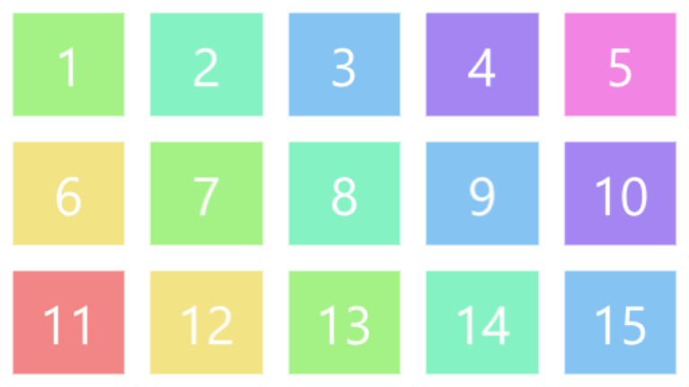

#### 枠色

枠の色を指定します。

#### 枠透明度

枠の透明度を指定します。

### セル内オブジェクトの設定

セル内に表示したオブジェクトに対して位置やサイズなどの調整を行います。

#### スケールモード

セルのサイズに合うように表示サイズをスケーリングします。

| モード | サンプル | 備考 |
| :---: | :---: | :---: |
| `外接最小` |  | セル内に収まるようにする |
| `内接最大` |  | セルを覆うようにする |
| `引き伸ばす` |  | セルのサイズと一致させる<br>（アスペクト比無視） |

#### X・Y

オブジェクトの位置をピクセル単位で指定します。

#### 拡大率

オブジェクトの拡大率を指定します。

#### 回転

オブジェクトの角度を指定します。

#### 透明度

オブジェクトの透明度を指定します。

#### 領域外

セルとオブジェクトの隙間をどのように埋めるかを指定します。

| モード | サンプル | 備考 |
| :---: | :---: | :---: |
| `透明` | 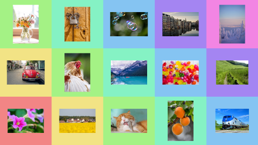 | 透明部分にセルを表示する |
| `指定色` | 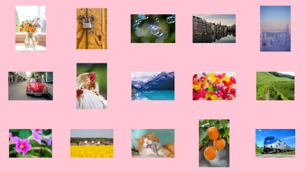 | 指定した色で塗りつぶす |
| `引き伸ばす` | 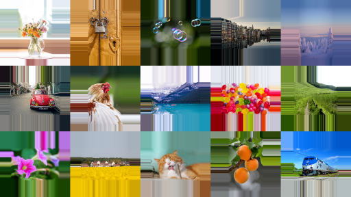 | 最も外側のピクセルで塗りつぶす |
| `ループ` | 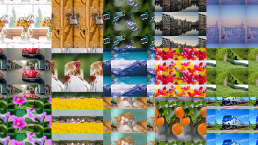 | 元の向きのまま繰り返す |
| `ミラー` |  | 反転しながら繰り返す |

#### 領域外の色

領域外が `指定色` のときの色を指定します。

### ラベル設定

#### X(%)・Y(%)

ラベルの位置をパーセンテージで指定します。

#### サイズ

ラベルのサイズをピクセル単位で指定します。

#### フォント

ラベルのフォントを指定します。

#### 文字色

文字列の色を指定します。

#### 影・縁色

影と縁の色を指定します。

#### 文字装飾

文字装飾を指定します。

#### ラベル表示

ラベルの表示状態を切り替えます。

#### 出力時非表示

有効にすると出力時にラベルを非表示にします。初期値は ON です。

### レイヤー設定

#### 読み込み

有効の場合はレイヤー上のオブジェクトを読み込みます。初期値は ON です。

#### セル番号を対象レイヤーにする

有効にするとセル番号を読み込むレイヤー番号として使用します。これはセル番号 1 ならレイヤー 1 を、 2 ならレイヤー 2 を読み込むため、[レイヤー](#レイヤー)に、

```lua
[1]=1, [2]=2, [3]=3, ...
```

と指定するのと同じです。  
※このチェックボックスが有効な場合は、レイヤーに指定した値は無視されます。

#### レイヤー

表示先のセルとそこに読み込むレイヤーを、`[セル番号]=レイヤー番号, [セル番号]=レイヤー番号, ...` の形式で指定します。

**例**：セル 3 にレイヤー 6 、セル 5 にレイヤー 8 のオブジェクトを表示する場合
```lua
[3]=6, [5]=8
```

### その他

#### セルサイズをログに出力する

有効にするとセルのサイズをログに出力します。

## セル設定(個別)

フィルタ効果の配置カテゴリーに追加されます。

セルを個別に編集するためのスクリプトです。  
[レイヤーグリッド表示](#レイヤーグリッド表示)カスタムオブジェクトに適用することで、セルに関連する設定を上書きすることができます。

#### セル番号

編集するセルの番号をカンマ区切りで指定します。

- 例：セル 1, 4, 7 を編集する場合

  ```lua
  1, 4, 7
  ```

### セル内オブジェクトの設定

#### セル内オブジェクトの設定を上書き

有効にすると[レイヤーグリッド表示](#レイヤーグリッド表示)の[セル内オブジェクトの設定](#セル内オブジェクトの設定)を上書きします。

### セル設定

#### セル設定を上書き

有効にすると[レイヤーグリッド表示](#レイヤーグリッド表示)の[セル設定](#セル設定)を上書きします。

### ラベル設定

#### ラベル設定を上書き

有効にすると[レイヤーグリッド表示](#レイヤーグリッド表示)の[ラベル設定](#ラベル設定)を上書きします。

**例**：
  - セル番号：`1,9,12`
  - セル設定を上書き：ON
    - 角丸：`80px`
    - 枠幅：`20px`
    - 枠色：`9eff9e`
  - セル内オブジェクトの設定を上書き：ON
    - スケールモード：`外接最小`


## グリッドオフセット設定(個別)

フィルタ効果の配置カテゴリーに追加されます。

グリッドオフセット値（[列オフセット](#列オフセット)、[行オフセット](#行オフセット)）をトラックバーで指定するためのものです。  
[セル設定(個別)](#セル設定個別)と同じく、[レイヤーグリッド表示](#レイヤーグリッド表示)カスタムオブジェクトに適用してください。

#### 対象列番号

対象とする列番号をカンマ区切りで指定します。

#### 列オフセット

列オフセット量を指定します。

#### 対象行番号

対象とする列番号をカンマ区切りで指定します。

#### 行オフセット

行オフセット量を指定します。

## 注意事項

- 指定したレイヤーのフレームバッファではなく、オブジェクトそのものを読み込むため、拡大率や座標移動などによるアニメーションは無視した状態で読み込まれます。
  - エフェクトは適用後の状態で読み込まれます。
  - 拡大率や座標などによるアニメーションを付けたオブジェクトを読み込みたい場合は、オブジェクトをシーンに配置し、そのシーンをレイヤーに配置することを推奨します。

- 一部のエフェクトを適用したオブジェクトは正常に読み込めない場合があります。正常に読み込めなかった場合はログに警告として出力されます。
  - `文字毎に個別オブジェクト` が有効なテキスト
  - `メッシュ変形` を適用したオブジェクト
  - `雲`、`星`、`雪`、`雨` など一部のカスタムオブジェクト
  - など

- [結合リスト](#結合リスト)に指定された領域に重複がある場合は、先に指定された領域が優先されて結合され、後から指定された領域は結合されません。
  - 領域の重複があった場合は、ログに警告が出力されます。

- [レイヤーグリッド表示](#レイヤーグリッド表示)にエフェクトが 1000 個以上付いている場合、それ以降の[セル設定(個別)](#セル設定個別)と[グリッドオフセット設定(個別)](#グリッドオフセット設定個別)は読み込まれません。

- 各セルは​個別オブジェクトと​して描画しているため、個別オブジェクトに対応したエフェクト（[DelayAni](https://booth.pm/ja/items/7234904) など）を適用することができます。

## 使用したツール

### [aulua](https://github.com/karoterra/aviutl2-aulua)

<details>
<summary>MIT License</summary>

```text
MIT License

Copyright (c) 2025 karoterra

Permission is hereby granted, free of charge, to any person obtaining a copy
of this software and associated documentation files (the "Software"), to deal
in the Software without restriction, including without limitation the rights
to use, copy, modify, merge, publish, distribute, sublicense, and/or sell
copies of the Software, and to permit persons to whom the Software is
furnished to do so, subject to the following conditions:

The above copyright notice and this permission notice shall be included in all
copies or substantial portions of the Software.

THE SOFTWARE IS PROVIDED "AS IS", WITHOUT WARRANTY OF ANY KIND, EXPRESS OR
IMPLIED, INCLUDING BUT NOT LIMITED TO THE WARRANTIES OF MERCHANTABILITY,
FITNESS FOR A PARTICULAR PURPOSE AND NONINFRINGEMENT. IN NO EVENT SHALL THE
AUTHORS OR COPYRIGHT HOLDERS BE LIABLE FOR ANY CLAIM, DAMAGES OR OTHER
LIABILITY, WHETHER IN AN ACTION OF CONTRACT, TORT OR OTHERWISE, ARISING FROM,
OUT OF OR IN CONNECTION WITH THE SOFTWARE OR THE USE OR OTHER DEALINGS IN THE
SOFTWARE.
```

</details>

### [aviutl2-cli](https://github.com/sevenc-nanashi/aviutl2-cli)

<details>
<summary>MIT License</summary>

```text
MIT License

Copyright (c) 2026 Nanashi. <sevenc7c.com>

Permission is hereby granted, free of charge, to any person obtaining a copy
of this software and associated documentation files (the "Software"), to deal
in the Software without restriction, including without limitation the rights
to use, copy, modify, merge, publish, distribute, sublicense, and/or sell
copies of the Software, and to permit persons to whom the Software is
furnished to do so, subject to the following conditions:

The above copyright notice and this permission notice shall be included in all
copies or substantial portions of the Software.

THE SOFTWARE IS PROVIDED "AS IS", WITHOUT WARRANTY OF ANY KIND, EXPRESS OR
IMPLIED, INCLUDING BUT NOT LIMITED TO THE WARRANTIES OF MERCHANTABILITY,
FITNESS FOR A PARTICULAR PURPOSE AND NONINFRINGEMENT. IN NO EVENT SHALL THE
AUTHORS OR COPYRIGHT HOLDERS BE LIABLE FOR ANY CLAIM, DAMAGES OR OTHER
LIABILITY, WHETHER IN AN ACTION OF CONTRACT, TORT OR OTHERWISE, ARISING FROM,
OUT OF OR IN CONNECTION WITH THE SOFTWARE OR THE USE OR OTHER DEALINGS IN THE
SOFTWARE.
```

</details>

## ライセンス

[MIT License](LICENSE.txt) に基づくものとします。

## 更新履歴

[CHANGELOG](CHANGELOG.md) を参照してください。
